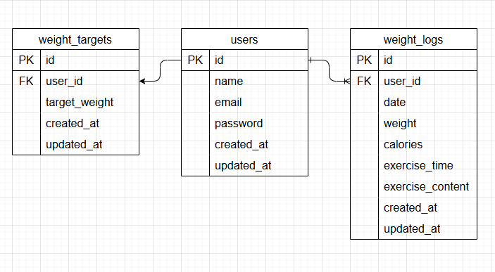

プロジェクト直下に.envを作成（既にファイルがあり以下の記述があれば不要）
touch .env

.envに以下を記述（UID/GIDはホストOSのユーザーIDに合わせて設定）
UID=1000
GID=1000

Docker ビルド 
docker-compose up -d --build

PHPコンテナに入る 
docker-compose exec php bash

Composer インストール 
composer install

.env 作成 
cp .env.example .env

アプリキー生成 
php artisan key:generate

マイグレーションの実行
php artisan migrate

ダミーデータの作成 
php artisan db:seed

PHPコンテナから出る　Ctrl+D

新規登録画面：http://localhost/register/step1
ログイン画面：http://localhost/login

～ダミーデータ～
ユーザー詳細
name:テスト太郎
email:test@example.com
パスワード:password

ER図

🧪 使用技術 
php:8.1-fpm 
Laravel Framework 8.83.8 
MySQL 8.0.26